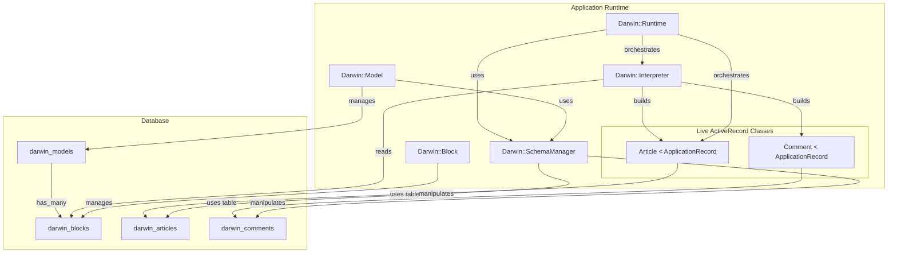

# Darwin Architecture Brief

## 2. Architecture

The Darwin architecture is composed of several key components that work together to transform database records into live ActiveRecord classes.

### Core Components

*   **`Darwin::Model`**: An ActiveRecord model that stores the high-level definition of a dynamic model (e.g., its name, "Article").
*   **`Darwin::Block`**: An ActiveRecord model that stores the individual components (attributes, associations, validations) of a `Darwin::Model`. Each block represents a single ActiveRecord macro call.
*   **`Darwin::SchemaManager`**: A service responsible for managing the database schema. It creates, alters, and drops tables and columns to keep the database in sync with the `Darwin::Model` definitions.
*   **`Darwin::Interpreter`**: A service that reads `Darwin::Block` records and applies them to a runtime class, translating stored data into ActiveRecord macro calls (e.g., `validates`, `has_many`).
*   **`Darwin::Runtime`**: A Ruby module that acts as a namespace and manager for the dynamically created classes. It orchestrates the loading, reloading, and unloading of the runtime models.

### Architectural Diagram



### The Multi-Pass Initialization Pattern

To handle circular dependencies (e.g., an `Author` `has_many :articles`, and an `Article` `belongs_to :author`), the runtime employs a **Multi-Pass Initialization Pattern**, orchestrated by `Darwin::Runtime.reload_all!`.

1.  **Pass 1: Class Definition**: Defines the "shell" for every runtime model.
2.  **Pass 2: Block Evaluation (with priority)**: All blocks are evaluated in a specific order to ensure dependencies are met. The priority is defined in `Darwin::Runtime.block_priority`.

This pattern is crucial for the stability of the runtime.

## 3. Testing Guidelines

Our testing strategy is built around a **self-contained, in-memory test environment** defined in `spec/rails_helper.rb`. We do **not** use a dummy Rails application.

*   **How to Run Tests**:
    ```bash
    bundle exec rspec
    ```
*   **Test Data**: Use the `setup_test_data!` helper from `spec/support/test_helpers.rb` to create a consistent set of test records.
*   **Common Pitfalls**:
    *   `NameError: uninitialized constant`: Likely a load order issue. Check `spec/rails_helper.rb`.
    *   **Database Mismatches**: Ensure the in-memory schema in `spec/rails_helper.rb` aligns with the production schema.

## 4. Debugging Cheat Sheet

Here are some useful commands for debugging the Darwin runtime in a Rails console.

### Reset Runtime Environment

```ruby
# Remove stale runtime constants
%w[Author Article Comment].each do |const|
  Object.send(:remove_const, const.to_sym) rescue nil
end

# Reload all runtime models from the database
Darwin::Runtime.reload_all!

# Rebind constants to live runtime classes
Author  = Darwin::Model.find_by(name: "Author").runtime_constant
Article = Darwin::Model.find_by(name: "Article").runtime_constant
Comment = Darwin::Model.find_by(name: "Comment").runtime_constant
```

### Inspect Associations

```ruby
# List all associations
Article.reflect_on_all_associations.map { |a| [a.macro, a.name] }

# Count how many times an association is defined (should be 1)
Article.reflect_on_all_associations(:has_many).count { |a| a.name == :comments }
```

### Inspect Callbacks

```ruby
# View and count destroy callbacks
Article._destroy_callbacks.map(&:filter)
Article._destroy_callbacks.count
```

### Inspect Darwin Model Definitions

```ruby
# List all Darwin models
Darwin::Model.pluck(:name)

# Inspect a specific model’s blocks
m = Darwin::Model.find_by(name: "Article")
m.blocks.pluck(:method_name, :args, :options)
```

## 5. Known Issues & Idempotency

A key challenge in the Darwin runtime is ensuring that reloading models is an **idempotent** operation. Previously, multiple reloads would cause duplicate associations and callbacks.

**The Fix**:
The `Darwin::Interpreter` now includes guard clauses to prevent re-defining an association if it already exists on the runtime class.

```ruby
# Example from lib/darwin/interpreter.rb
when "has_many"
  assoc_name = block.args.first.to_sym
  return if klass.reflect_on_association(assoc_name)
  # ... proceed to define association
```

This ensures that `Darwin::Runtime.reload_all!` can be called safely multiple times.