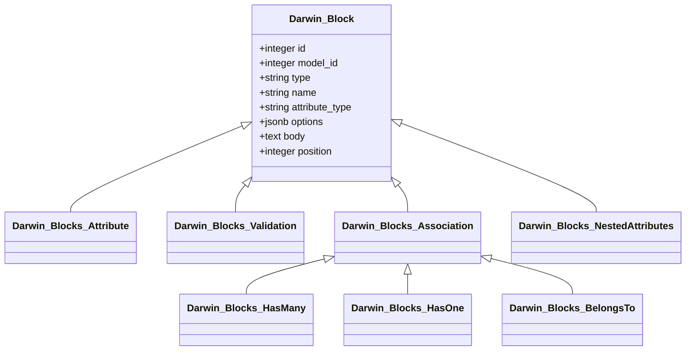

# Darwin::Block STI Refactoring Plan

This document outlines the plan to refactor the `Darwin::Block` model to use a Single Table Inheritance (STI) architecture.

### Analysis of `method_name` values

Based on the search results, I've identified the following `method_name` values:

-   `attribute`
-   `validates`
-   `has_many`
-   `has_one`
-   `belongs_to`
-   `accepts_nested_attributes_for`

### Proposed STI Architecture

Here is the proposed STI architecture for the `Darwin::Block` model.

#### 1. STI Class Hierarchy

I propose the following class hierarchy, with `Darwin::Block` as the base class:

-   `Darwin::Block` (base class)
    -   `Darwin::Blocks::Attribute`
    -   `Darwin::Blocks::Validation`
    -   `Darwin::Blocks::Association` (a base class for associations)
        -   `Darwin::Blocks::HasMany`
        -   `Darwin::Blocks::HasOne`
        -   `Darwin::Blocks::BelongsTo`
    -   `Darwin::Blocks::NestedAttributes`

This hierarchy provides a clear and organized structure for the different block types.

#### 2. New Database Schema

To support the STI architecture, the `darwin_blocks` table will be modified as follows:

-   **Add a `type` column**: A `type` column (string) will be added to store the class name of the STI model (e.g., `"Darwin::Blocks::Attribute"`). This is the standard Rails convention for STI.
-   **Remove the `method_name` column**: The `method_name` column will be removed, as the `type` column will now serve this purpose.
-   **Remove the `args` column**: The ambiguous `args` column will be removed.
-   **Add specific, strongly-typed columns**: The `args` column will be replaced with specific columns for each subclass. This will provide a more robust and scalable solution.

Here is the proposed schema for the `darwin_blocks` table:

| Column | Type | Description |
| --- | --- | --- |
| `id` | `integer` | Primary key |
| `model_id` | `integer` | Foreign key to `darwin_models` |
| `type` | `string` | STI type (e.g., `"Darwin::Blocks::Attribute"`) |
| `name` | `string` | For `Attribute`, `Validation`, and `Association` blocks |
| `attribute_type` | `string` | For `Attribute` blocks (e.g., `"string"`, `"integer"`) |
| `options` | `jsonb` | For all block types, to store additional options |
| `body` | `text` | For custom blocks |
| `position` | `integer` | For ordering |
| `created_at` | `datetime` | |
| `updated_at` | `datetime` | |

#### 3. Refactoring Plan

The refactoring process will involve the following steps:

1.  **Create a new migration**:
    -   Add the `type` column to the `darwin_blocks` table.
    -   Add the new columns (`name`, `attribute_type`).
    -   Write a data migration to populate the new columns based on the existing `method_name` and `args` data.
    -   Remove the `method_name` and `args` columns.
2.  **Create the new STI models**:
    -   Create the new STI model files (e.g., `app/models/darwin/blocks/attribute.rb`).
    -   Move the relevant logic from `Darwin::Block` to the new subclasses.
3.  **Update the `Darwin::Block` model**:
    -   Remove the virtual attributes (`args_name`, `args_type`).
    -   Remove the `assemble_args` and `load_virtual_attributes` methods.
4.  **Update the controllers and views**:
    -   Update the `Darwin::ModelsController` to use the new STI models.
    -   Update the views to use the new columns instead of the `args` and `options` columns.
5.  **Update the `Darwin::Interpreter`**:
    -   Update the `Darwin::Interpreter` to use the new STI models.

### Mermaid Diagram

This plan provides a clear path to refactor the `Darwin::Block` model to a more robust and scalable STI architecture.